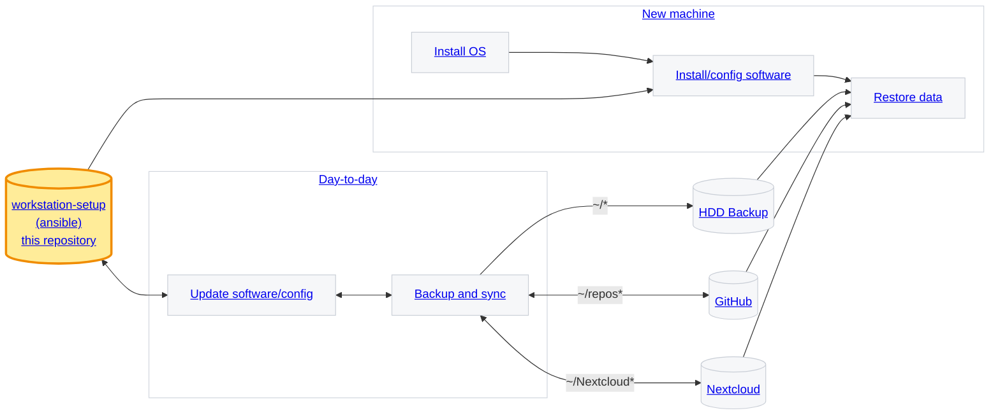

# Workstation setup

> [!NOTE]
> **TODO**
> - “secrets / keys / credentials” source of truth
> - personal configuration (private keys, password vault)
> - TBD: emergency USB-stick?
> - TBD: setup: - workspace: gtd-setup with action, inbox, projects (containing symlinks to repos and nextcloud directories)
> -> TODO: document backups




## workstation-setup

Install ansible and clone the repository

```sh
sudo dnf -y install git ansible-core python3-pip
ansible --version
git --version
```

Ansible collections

```sh
ansible-galaxy collection install community.general community.docker
```

Clone workstation-setup repository

```sh
git clone git@github.com:fs-ise/workstation-setup.git
```

Install/update software

```sh
cd workstation-setup

# copy host_vars/localhost.yml.example to host_vars/localhost.yml

ansible-playbook -K playbooks/lab-stack.yml

# upon dnf config-manager: command not found
sudo dnf -y install dnf-plugins-core
ansible-playbook -K playbooks/lab-stack.yml
```

Run only one role:

```sh
ansible-playbook -K playbooks/lab-stack.yml --tags baseline
ansible-playbook -K playbooks/lab-stack.yml --tags ocr
ansible-playbook -K playbooks/lab-stack.yml --tags virtualbox
ansible-playbook -K playbooks/lab-stack.yml --tags docker
ansible-playbook -K playbooks/lab-stack.yml --tags quarto
ansible-playbook -K playbooks/lab-stack.yml --tags chrome
ansible-playbook -K playbooks/lab-stack.yml --tags vscode
ansible-playbook -K playbooks/lab-stack.yml --tags desktop
```

You can also combine tags, e.g. `--tags baseline,docker,vscode`.

## Day-to-day

### Update software and configuration

Ansible setup repository (TODO: explain idempotency).

### Backup and sync

Assumes a particular structure of directories

- Nextcloud (shared and personal dirs)
- repos
- workstation (local / symlinks / GTD)

## New machine

### Install OS

Install Fedora

Advantages of Fedora:

* parallel downloads for faster updates
* delta RPMs to save bandwidth
* modular system for version control
* persistent metadata caching
* undoable transactions
* simpler and easier-to-remember commands

There are more but these make DNF much more convenient than APT.

### Install and configure software

In the workstation-setup repository, run `make lab-stack`.

**Manual tasks**

- Set up SSH and register on GitHub

```sh
ssh-keygen -t ed25519 -a 64 -C "your-email@institution.edu"
ssh-add ~/.ssh/id_ed25519
cat ~/.ssh/id_ed25519.pub | wl-copy
# add in GitHub settings/ssh
```

- Set up GPG and register on GitHub ([instructions](https://docs.github.com/en/authentication/managing-commit-signature-verification/telling-git-about-your-signing-key))

**Tests**

```sh
git config --global user.name
git config --global user.email

docker version
docker run --rm hello-world

ssh -V
ls -la ~/.ssh/*.pub 2>/dev/null || echo "No SSH public keys found"
ssh-add -l || true
ssh -T git@github.com

quarto --version
quarto check
```

Quarto test

```sh
mkdir -p ~/tmp-quarto-test && cd ~/tmp-quarto-test
cat > test.qmd <<'EOF'
---
title: "Lab Stack Test"
format: html
---

## It works

- Quarto: `r quarto::quarto_version()` (if R is installed)
- Docker: tested separately
- Git: configured
EOF

quarto render test.qmd
ls -la
```

### Restore data

## External data sources

### HDD backup

Covers all files in `/home/username` (including Nextcloud and Git repositories)

Based on Vorta/Borg

- Protects against ransomware / cloud account compromise
- HDD: versioned snapshots
- HDD backups are encrypted
- HDDs are disconnected (different weekly / monthly / annual HDDs)

### GitHub

Serves as a synchronization mechanism. Repositories can be private or public. Git repositories can be local only. Repositories are also backed up on HDD.

Additional "backup copy" (even synced across devices)

### Nextcloud

Serves as a synchronization mechanism. Nextcloud data is also backed up on HDD.

Files (e.g., PDFs and media files that are not in git repositories or zipped archives of git repositories for completed projects; ideally stable, without symlinks, no unzipped git repositories; shared or personal)

Additional "backup copy"