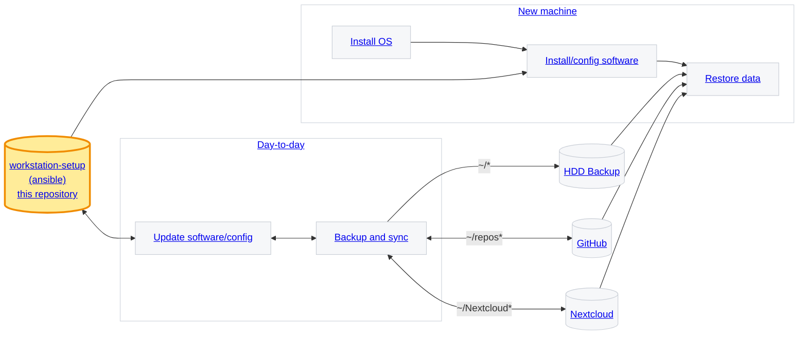

# Workstation setup

## Overview


```mermaid
flowchart LR
  %% External infrastructure (outside the subgraphs)
  GH[(<a href='https://github.com/fs-ise/workstation-setup?tab=readme-ov-file#github'>GitHub</a>)]
  BK[(<a href='https://github.com/fs-ise/workstation-setup?tab=readme-ov-file#hdd-backup'>HDD Backup</a>)]
  NC[(<a href='https://github.com/fs-ise/workstation-setup?tab=readme-ov-file#nextcloud'>Nextcloud</a>)]
  A[("<a href='https://github.com/fs-ise/workstation-setup?tab=readme-ov-file#workstation-setup'>workstation-setup<br/>(ansible)<br/>this repository</a>")]

  %% Day-to-day flow
  subgraph Daily["<a href='https://github.com/fs-ise/workstation-setup?tab=readme-ov-file#day-to-day'>Day-to-day</a>"]
     AUpd["<a href='https://github.com/fs-ise/workstation-setup?tab=readme-ov-file#update-software-and-configuration'>Update software/config</a>"] <--> S[<a href='https://github.com/fs-ise/workstation-setup?tab=readme-ov-file#backup-and-sync'>Backup and sync</a>]
  end
  A <--> AUpd
  S -- ~/* --> BK
  S <-- ~/repos* --> GH
  S <-- ~/Nextcloud* --> NC

  %% New machine flow
  subgraph New["<a href='https://github.com/fs-ise/workstation-setup?tab=readme-ov-file#new-machine'>New machine</a>"]
    OS[<a href='https://github.com/fs-ise/workstation-setup?tab=readme-ov-file#install-os'>Install OS</a>]
    OS --> AInst["<a href='https://github.com/fs-ise/workstation-setup?tab=readme-ov-file#install-and-configure-software'>Install/config software</a>"] --> R
    R[<a href='https://github.com/fs-ise/workstation-setup?tab=readme-ov-file#restore-data'>Restore data</a>]
  end
  A --> AInst

  BK --> R
  GH --> R
  NC --> R

  %% Styling
  classDef highlight fill:#ffec99,stroke:#f08c00,stroke-width:3px,color:#1b1b1b;
  classDef muted fill:#f6f7f9,stroke:#c9ced6,stroke-width:1px,color:#2b2b2b;

  class A highlight;
  class GH,BK,NC,AUpd,S,OS,AInst,R muted;

  %% Optional: soften subgraph borders
  style Daily fill:#ffffff,stroke:#d0d5dd,stroke-width:1px;
  style New fill:#ffffff,stroke:#d0d5dd,stroke-width:1px;

```

Install ansible and clone the repository

```sh
sudo dnf -y install git ansible-core python3-pip
ansible --version
git --version
```

Ansible collections

```sh
ansible-galaxy collection install community.general community.docker
```

Clone workstation-setup repository

```sh
git clone git@github.com:fs-ise/workstation-setup.git
```

Enable SSH server on remote host (by default disabled on Fedora Workstation)
```
# Run this command manually on the remote host
sudo systemctl enable --now sshd
```

Install/update software

```sh
cd workstation-setup

# copy host_vars/localhost.yml.example to host_vars/localhost.yml

cat << EOF > inventory
[local]
localhost ansible_connection=local ansible_python_interpreter=/usr/bin/python3
EOF

ansible-playbook -i inventory -K playbooks/lab-stack.yml

# upon dnf config-manager: command not found
sudo dnf -y install dnf-plugins-core
ansible-playbook -i inventory -K playbooks/lab-stack.yml
```

Run only one role:

```sh
ansible-playbook -i inventory -K playbooks/lab-stack.yml --tags baseline
ansible-playbook -i inventory -K playbooks/lab-stack.yml --tags ocr
ansible-playbook -i inventory -K playbooks/lab-stack.yml --tags virtualbox
ansible-playbook -i inventory -K playbooks/lab-stack.yml --tags docker
ansible-playbook -i inventory -K playbooks/lab-stack.yml --tags local_llm
ansible-playbook -i inventory -K playbooks/lab-stack.yml --tags grobid
ansible-playbook -i inventory -K playbooks/lab-stack.yml --tags languagetool
ansible-playbook -i inventory -K playbooks/lab-stack.yml --tags quarto
ansible-playbook -i inventory -K playbooks/lab-stack.yml --tags chrome
ansible-playbook -i inventory -K playbooks/lab-stack.yml --tags vscode
ansible-playbook -i inventory -K playbooks/lab-stack.yml --tags teams
ansible-playbook -i inventory -K playbooks/lab-stack.yml --tags desktop
```

You can also combine tags, e.g. `--tags baseline,docker,grobid,vscode`.


## Local LLMs (Ollama + Open WebUI)

This repository includes a `local_llm` role that runs:

- `ollama` (API on `127.0.0.1:11434`)
- `open-webui` (web UI on `http://127.0.0.1:3000`)

Both services run in Docker with persistent storage under `/opt/local-llm`:

- Ollama models: `/opt/local-llm/ollama`
- Open WebUI data: `/opt/local-llm/open-webui`

Install only this role:

```sh
ansible-playbook -i inventory -K playbooks/lab-stack.yml --tags local_llm
```

Optional model preloading (to avoid manual `ollama pull` after install):

```yaml
# host_vars/localhost.yml
local_llm_models:
  - llama3.2:3b
```

Optional Open WebUI defaults:

```yaml
# host_vars/localhost.yml
local_llm_webui_auth: true
local_llm_webui_default_models: "llama3.2:3b"
```

Quick checks:

```sh
curl -s http://127.0.0.1:11434/api/tags | jq .
curl -I http://127.0.0.1:3000
docker ps --format 'table {{.Names}}\t{{.Status}}\t{{.Ports}}' | grep -E 'ollama|open-webui'
```

## Day-to-day

### Update software and configuration

In this Ansible setup repository.

### Backup and sync

Assumes a particular structure of directories

- Nextcloud (shared and personal dirs)
- repos
- workstation (local / symlinks / GTD)

## New machine

### Install OS

Install Fedora Workstation

* Workstation includes the GNOME (vanilla) Desktop Environment
* Get it [here](https://fedoraproject.org/workstation/download/)

Advantages of Fedora:

* parallel downloads for faster updates
* delta RPMs to save bandwidth
* modular system for version control
* persistent metadata caching
* undoable transactions
* simpler and easier-to-remember commands

There are more but these make DNF much more convenient than APT.

### Install and configure software

In the workstation-setup repository, run `make lab-stack`.

**Manual tasks**

- Set up SSH and register on GitHub

```sh
ssh-keygen -t ed25519 -a 64 -C "your-email@institution.edu"
ssh-add ~/.ssh/id_ed25519
cat ~/.ssh/id_ed25519.pub | wl-copy
# add in GitHub settings/ssh
```

- Set up GPG and register on GitHub ([instructions](https://docs.github.com/en/authentication/managing-commit-signature-verification/telling-git-about-your-signing-key))

**Tests**

```sh
git config --global user.name
git config --global user.email

docker version
docker run --rm hello-world

ssh -V
ls -la ~/.ssh/*.pub 2>/dev/null || echo "No SSH public keys found"
ssh-add -l || true
ssh -T git@github.com

quarto --version
quarto check
```

Quarto test

```sh
mkdir -p ~/tmp-quarto-test && cd ~/tmp-quarto-test
cat > test.qmd <<'EOF'
---
title: "Lab Stack Test"
format: html
---

## It works

- Quarto: `r quarto::quarto_version()` (if R is installed)
- Docker: tested separately
- Git: configured
EOF

quarto render test.qmd
ls -la
```

Languagetool test

```shell
curl -d "text=This are bad sentence.&language=en-US" http://localhost:8081/v2/check
```

Chrome: Advanced settings (only for professional users) - LanguageTool server: Local server

Test: should return no match for `fs-ise`:

```shell
curl -s -X POST "http://127.0.0.1:8081/v2/check" \
  -H "Content-Type: application/x-www-form-urlencoded" \
  --data "text=This is fs-ise and it should not be flagged.&language=en-US" \
  | jq '.matches'
```

### Restore data

- `workstation` and `repos` from HDD
- `Nextcloud`: through sync
- Directories (e.g., Thunderbird/including extensions)

TODO : restoring individual files (link video/explanation?)

## External data sources

### HDD backup

Covers all files in `/home/username` (including Nextcloud and Git repositories)

Based on Vorta/Borg

- Protects against ransomware / cloud account compromise
- HDD: versioned snapshots
- HDD backups are encrypted
- HDDs are disconnected (different weekly / monthly / annual HDDs)

### GitHub

Serves as a synchronization mechanism. Repositories can be private or public. Git repositories can be local only. Repositories are also backed up on HDD.

Additional "backup copy" (even synced across devices)

### Nextcloud

Serves as a synchronization mechanism. Nextcloud data is also backed up on HDD.

Files (e.g., PDFs and media files that are not in git repositories or zipped archives of git repositories for completed projects; ideally stable, without symlinks, no unzipped git repositories; shared or personal)

Additional "backup copy"
