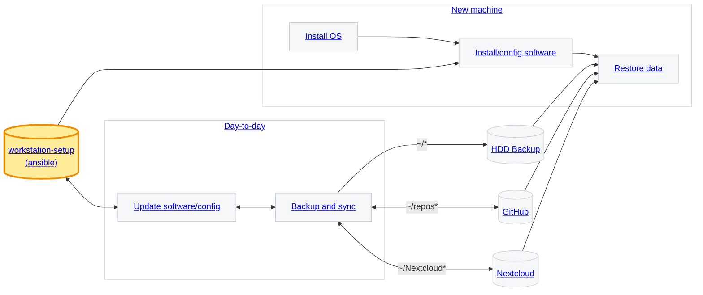

# Workstation setup



## Day-to-day

### Update software and configuration


### Backup and sync

## New machine

### Install OS

Install Fedora

Advantages of Fedora:

* parallel downloads for faster updates
* delta RPMs to save bandwidth
* modular system for version control
* persistent metadata caching
* undoable transactions
* simpler and easier-to-remember commands

There are more but these make DNF much more convenient than APT.

### Install and configure software

### Restore data

## External data sources

### workstation-setup

Ansible setup repository (TODO: explain idempotency).

Install ansible and clone the repository

```sh
sudo dnf -y install git ansible-core python3-pip
ansible --version
git --version
```

Ansible collections

```sh
ansible-galaxy collection install community.general community.docker
```

Clone workstation-setup repository

```sh
git clone git@github.com:fs-ise/workstation-setup.git
```

Install/update software

```sh
cd workstation-setup

# copy host_vars/localhost.yml.example to host_vars/localhost.yml

ansible-playbook -K playbooks/lab-stack.yml

# upon dnf config-manager: command not found
sudo dnf -y install dnf-plugins-core
ansible-playbook -K playbooks/lab-stack.yml
```

Run only one role:

```sh
ansible-playbook -K playbooks/lab-stack.yml --tags baseline
ansible-playbook -K playbooks/lab-stack.yml --tags ocr
ansible-playbook -K playbooks/lab-stack.yml --tags virtualbox
ansible-playbook -K playbooks/lab-stack.yml --tags docker
ansible-playbook -K playbooks/lab-stack.yml --tags quarto
ansible-playbook -K playbooks/lab-stack.yml --tags chrome
ansible-playbook -K playbooks/lab-stack.yml --tags vscode
ansible-playbook -K playbooks/lab-stack.yml --tags desktop
```

You can also combine tags, e.g. `--tags baseline,docker,vscode`.


**Manual tasks**

- Set up SSH and register on GitHub

```sh
ssh-keygen -t ed25519 -a 64 -C "your-email@institution.edu"
ssh-add ~/.ssh/id_ed25519
cat ~/.ssh/id_ed25519.pub | wl-copy
# add in GitHub settings/ssh
```

- Set up GPG and register on GitHub ([instructions](https://docs.github.com/en/authentication/managing-commit-signature-verification/telling-git-about-your-signing-key))

**Tests**

```sh
git config --global user.name
git config --global user.email

docker version
docker run --rm hello-world

ssh -V
ls -la ~/.ssh/*.pub 2>/dev/null || echo "No SSH public keys found"
ssh-add -l || true
ssh -T git@github.com

quarto --version
quarto check
```

Quarto test

```sh
mkdir -p ~/tmp-quarto-test && cd ~/tmp-quarto-test
cat > test.qmd <<'EOF'
---
title: "Lab Stack Test"
format: html
---

## It works

- Quarto: `r quarto::quarto_version()` (if R is installed)
- Docker: tested separately
- Git: configured
EOF

quarto render test.qmd
ls -la
```


### HDD backup

### GitHub

### Nextcloud
